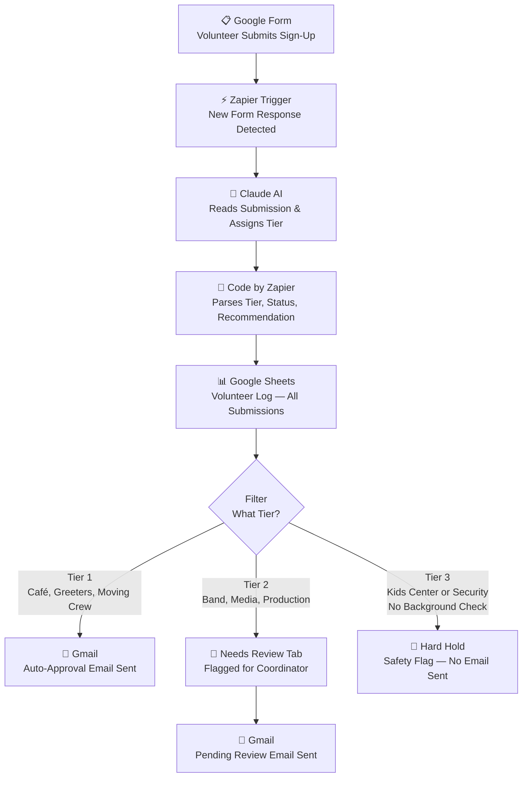

# Church & Non-Profit Volunteer Coordinator Automation

**Built by [Christopher Smith](https://github.com/flcaismith) | Agent Smith AI**

An AI-powered, end-to-end volunteer intake and routing workflow built for churches and non-profit organizations. Designed to eliminate manual coordination overhead while enforcing safety policies automatically.

> *"AI didn't make this process less personal. It made it more reliable, more consistent, and more safe."*

---

## The Problem

Every week, volunteer coordinators at churches and nonprofits manually read sign-up responses, cross-reference availability, assign roles by memory, and individually notify every volunteer — all while managing a dozen other responsibilities.

With no system in place:
- People show up to the wrong role
- Safety-sensitive positions get filled without proper vetting
- Coordinators burn out doing work that should take minutes, not hours

This project was built to solve that problem for a real community.

---

## Tech Stack

| Tool | Role |
|---|---|
| Google Forms | Volunteer intake |
| Zapier | Automation platform and orchestration |
| Claude AI (Anthropic) | Tier classification and recommendation generation |
| JavaScript / Regex | Deterministic response parsing |
| Google Sheets | Structured logging and audit trail |
| Gmail | Personalized volunteer confirmation emails |

---

## Workflow Architecture



---

## The Three-Tier Decision Matrix

This system implements a **Human-in-the-Loop (HITL)** design. Claude triages every submission, but humans retain authority over high-stakes decisions.

### Tier 1 — Auto-Approved
**Roles:** Café, Greeters, Moving Crew

Low complexity, no special qualifications required. Volunteer receives an immediate personalized confirmation email. No coordinator action needed.

### Tier 2 — Pending Review
**Roles:** Band, Media, Production

Skill-dependent roles where human judgment is required to assess fit. Claude generates a coordinator recommendation, submission is routed to the Needs Review queue, and a pending confirmation email is sent to the volunteer.

### Tier 3 — Hard Hold
**Roles:** Kids Center, Security (when no background check on file)

Safety-sensitive positions. Submission is flagged immediately, logged to the Needs Review queue, and **no email is sent** until a coordinator manually clears the hold. Background check confirmation is required before any assignment is made.

---

## Claude Prompt

```
You are a volunteer coordinator assistant for a church. A new volunteer has submitted a sign-up form. Based on their submission, do the following:

1. Determine their TIER:
- TIER 1: Café, Greeters, Moving Crew — auto-approve
- TIER 2: Band, Media, Production — flag for human review (skill-based)
- TIER 3: Kids Center or Security AND background check is "No" — hard flag, safety concern

2. Write a SHORT AI recommendation (2-3 sentences max) summarizing the volunteer's fit for their chosen role.

3. Determine their Status:
- Tier 1: "Auto-Approved"
- Tier 2: "Pending Review"
- Tier 3: "Hold - Background Check Required"

4. Determine their Review Reason:
- Tier 1: leave blank
- Tier 2: "Skill-based role"
- Tier 3: "Background check required"

Here is the volunteer submission:
Name: [Full Name]
Role: [Role]
Sundays: [Sunday Dates]
Experience: [Experience Notes]
Background Check on File: [Yes/No]

Respond ONLY in this exact format, nothing else. No extra text, no punctuation after the labels:

TIER:
STATUS:
AI_RECOMMENDATION:
REVIEW_REASON:
```

---

## JavaScript Parser

Claude returns plain labeled text. This JavaScript snippet (run via Code by Zapier) extracts all four fields deterministically using regex — a **defensive engineering** approach that ensures consistent structured output regardless of minor AI response variation.

```javascript
const text = inputData.claude_output.replace(/\n/g, ' ');

const tier = (text.match(/TIER:\s*(.+?)(?=STATUS:|$)/) || [])[1]?.trim() || "";
const status = (text.match(/STATUS:\s*(.+?)(?=AI_RECOMMENDATION:|$)/) || [])[1]?.trim() || "";
const ai_recommendation = (text.match(/AI_RECOMMENDATION:\s*(.+?)(?=REVIEW_REASON:|$)/) || [])[1]?.trim() || "";
const review_reason = (text.match(/REVIEW_REASON:\s*(.+?)$/) || [])[1]?.trim() || "";

return { tier, status, ai_recommendation, review_reason };
```

> **Why plain text over JSON?** Zapier's native JSON parsing tools were limited on this plan. More importantly, LLMs can be brittle with strict JSON formatting. Plain labeled text with regex extraction creates a more resilient, fault-tolerant pipeline.

---

## Test Results

Three submissions were used to validate all routing paths:

| Volunteer | Role | Tier | Status | Notes |
|---|---|---|---|---|
| Chris Smith | Band | 2 | Pending Review | 20+ years piano/keyboard experience, Easter Sunday |
| Marina Perez | Greeters | 1 | Auto-Approved | Front desk experience, available all 4 Sundays |
| Alyssa Berger | Kids Center | 3 | Hold - Background Check Required | Pediatric nurse, au pair — flagged for missing background check |

All three tiers fired correctly on first live run.

---

## Google Sheets Output

Two tabs in the Volunteer Management sheet:

**Volunteer Log** — every submission logged regardless of tier
`Timestamp | Name | Email | Phone | Sunday Date(s) | Role | Experience Notes | Background Check | AI Recommendation | Tier | Status`

**Needs Review** — Tier 2 and Tier 3 only
`Timestamp | Name | Email | Phone | Sunday Date(s) | Role | Experience Notes | Background Check | AI Recommendation | Tier | Status | Review Reason`

The Needs Review tab creates a **permanent, searchable audit log** — critical for non-profit compliance and safety policy enforcement.

---

## Future Improvements

- SMS notifications via Twilio for volunteers who miss confirmation emails
- Coordinator-facing dashboard showing Tier breakdown and weekly volunteer counts
- Automated follow-up for Tier 3 holds: *"Your background check is still pending"*
- Reply confirmation mechanism to track no-shows before Sunday
- Multi-service support beyond single Sunday morning format

---

## Project Context

Built as the TripleTen AI Automation Capstone (Sprint 7 Final Project).

Reviewed and approved by Senior Architect with the following notes:
> *"This is a sophisticated, 'Defense-in-Depth' engineering solution to a high-stakes real-world problem. By combining Claude's reasoning with Custom JavaScript parsing, you've built a system that is more resilient than many professional enterprise implementations... This is a world-class Capstone project."*

---

*Built with Zapier, Google Forms, Google Sheets, Gmail, and Claude AI.*
*Designed for the people who show up every week without being asked.*